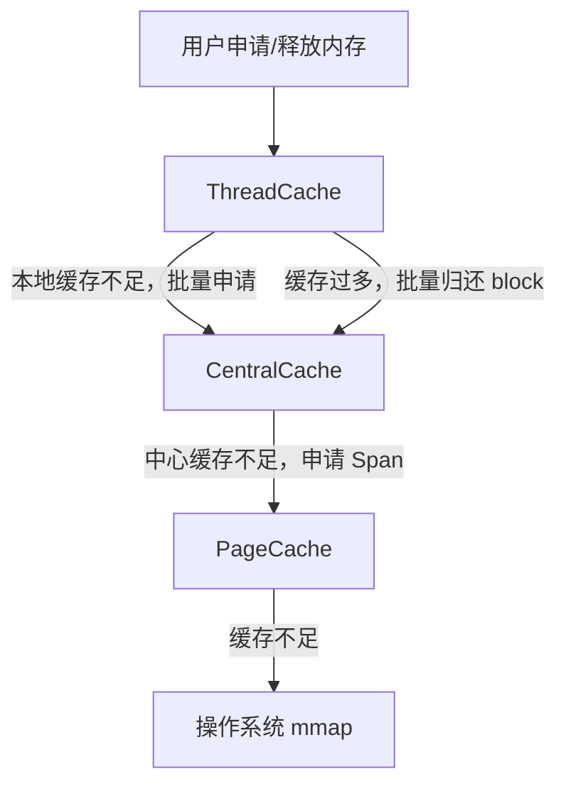

# Memory Pool

一个基于 **ThreadCache / CentralCache / PageCache** 三层结构实现的 C++ 内存池项目，主要用于优化小对象频繁分配与多线程场景下的内存分配性能。

项目参考了 tcmalloc 的分层缓存思想：线程优先从自己的本地缓存中申请内存，本地缓存不足时再向中心缓存批量获取，中心缓存不足时再向页缓存申请大块连续内存。

---

## 项目特点

- 使用 C++17 实现，代码结构清晰，便于学习和扩展
- 采用三层缓存结构：`ThreadCache`、`CentralCache`、`PageCache`
- `ThreadCache` 使用 `thread_local`，减少多线程场景下的锁竞争
- 小对象按照 8 字节对齐，并映射到不同的 size class
- 空闲内存块复用自身空间作为链表节点，减少额外元数据开销
- `CentralCache` 按 size class 分桶加锁，降低不同规格内存之间的竞争
- `PageCache` 以页为单位管理大块内存，并使用 `mmap` 向操作系统申请内存
- 提供正确性测试和性能测试，覆盖基础分配、边界大小、内存复用和多线程场景

---

## 项目结构

```text
memory_pool/
├── include/
│   ├── Common.h          # 公共常量、size class 映射工具
│   ├── ThreadCache.h     # 线程本地缓存接口
│   ├── CentralCache.h    # 中心缓存接口
│   └── PageCache.h       # 页缓存接口
│
├── src/
│   ├── ThreadCache.cpp   # ThreadCache 实现
│   ├── CentralCache.cpp  # CentralCache 实现
│   └── PageCache.cpp     # PageCache 实现
│
├── test/
│   └── test_memory_pool.cpp  # 正确性测试与性能测试
│
├── CMakeLists.txt
├── README.md
└── .gitignore
```

---

## 整体架构



### 三层缓存职责

| 模块 | 职责 |
|---|---|
| `ThreadCache` | 每个线程独立持有的本地缓存，负责快速分配和释放小块内存 |
| `CentralCache` | 所有线程共享的中心缓存，负责在线程之间批量调度内存块 |
| `PageCache` | 页级缓存，负责管理连续页组成的 Span，并在不足时向系统申请内存 |

---

## 核心设计

### 1. Size Class 管理

项目将小对象按照 8 字节对齐，并映射到对应的自由链表。

例如：

| 用户申请大小 | 实际对齐大小 | size class 下标 |
|---:|---:|---:|
| 1 | 8 | 0 |
| 8 | 8 | 0 |
| 9 | 16 | 1 |
| 16 | 16 | 1 |
| 17 | 24 | 2 |

相关代码位于 `include/Common.h`：

```cpp
static inline size_t roundUp(size_t bytes)
{
    return (bytes + ALIGNMENT - 1) & ~(ALIGNMENT - 1);
}

static inline size_t getIndex(size_t bytes)
{
    return (bytes <= ALIGNMENT) ? 0 : ((bytes - 1) >> 3);
}
```

---

### 2. ThreadCache

`ThreadCache` 是线程本地缓存，每个线程拥有独立实例：

```cpp
static thread_local ThreadCache instance;
```

每个 `ThreadCache` 内部维护多个自由链表：

```cpp
std::array<void*, FREE_LIST_SIZE> freeList_{};
std::array<uint32_t, FREE_LIST_SIZE> freeListSize_{};
```

当线程申请内存时：

1. 如果本地自由链表有空闲块，直接返回；
2. 如果本地自由链表为空，向 `CentralCache` 批量申请；
3. 返回其中一个 block 给用户，其余 block 留在当前线程缓存中。

释放内存时：

1. 先将 block 放回当前线程的自由链表；
2. 如果当前线程缓存数量超过高水位线，则批量归还一部分给 `CentralCache`。

---

### 3. CentralCache

`CentralCache` 是所有线程共享的中心缓存。

它按照 size class 维护自由链表，并为每个 size class 配置独立锁：

```cpp
std::array<void*, FREE_LIST_SIZE> centralFreeList_{};
std::array<std::mutex, FREE_LIST_SIZE> locks_{};
```

这种设计可以避免所有大小的内存分配都争用同一把锁。

当 `ThreadCache` 向 `CentralCache` 申请内存时，`CentralCache` 会批量返回多个 block。若对应规格的中心自由链表为空，则会向 `PageCache` 申请一个 Span，并将 Span 切分成多个相同大小的 block。

---

### 4. PageCache

`PageCache` 是最底层的页缓存，管理单位是 Span。

```cpp
struct Span {
    void* pageAddr;
    size_t numPages;
    Span* next;
    bool isFree;
};
```

一个 Span 表示一段连续页，例如：

```text
8 pages = 8 * 4096 = 32768 bytes
```

当 `CentralCache` 没有足够内存时，会向 `PageCache` 申请若干页。`PageCache` 优先从已有空闲 Span 中查找合适空间；如果没有合适 Span，则通过 `mmap` 向操作系统申请新内存。

---

## 分配流程

```text
allocate(size)
    |
    v
size > MAX_BYTES ?
    | yes
    v
直接使用 malloc
    |
    no
    v
ThreadCache 是否有对应规格的空闲 block？
    | yes
    v
直接返回
    |
    no
    v
向 CentralCache 批量申请 block
    |
    v
CentralCache 是否有空闲 block？
    | yes
    v
批量返回给 ThreadCache
    |
    no
    v
向 PageCache 申请 Span
    |
    v
PageCache 不足时通过 mmap 向系统申请内存
    |
    v
切分 Span 为多个 block
    |
    v
返回给 ThreadCache
```

---

## 释放流程

```text
deallocate(ptr, size)
    |
    v
ptr == nullptr ?
    | yes
    v
直接返回
    |
    no
    v
size > MAX_BYTES ?
    | yes
    v
直接使用 free
    |
    no
    v
放回当前线程 ThreadCache 的自由链表
    |
    v
ThreadCache 缓存是否超过高水位线？
    | no
    v
结束
    |
    yes
    v
批量归还部分 block 给 CentralCache
```

当前版本中，小块内存释放后主要会回到 `ThreadCache` 或 `CentralCache` 中复用；暂未实现 `CentralCache` 将完全空闲的 Span 主动归还给 `PageCache` 的完整机制。

---

## 构建方式

### 环境要求

- Linux
- CMake >= 3.16
- 支持 C++17 的编译器，例如 GCC 或 Clang
- pthread

### 编译

```bash
mkdir -p build
cd build
cmake ..
make
```

### 运行测试

```bash
./test_memory_pool
```

或者使用 CTest：

```bash
ctest --output-on-failure
```

### Debug 模式开启 AddressSanitizer

```bash
mkdir -p build
cd build
cmake .. -DCMAKE_BUILD_TYPE=Debug -DMEMORY_POOL_ENABLE_ASAN=ON
make
./test_memory_pool
```

---

## 测试内容

测试代码位于：

```text
test/test_memory_pool.cpp
```

主要包括两部分：

### 正确性测试

| 测试项 | 说明 |
|---|---|
| Basic sizes | 测试常见大小的申请、写入、校验和释放 |
| Boundary sizes | 测试 8、16、32、256KB 等边界附近的大小 |
| Reuse behavior | 测试释放后的内存是否可以被再次复用 |
| Multi-thread smoke | 测试多线程并发申请和释放时是否正常 |

### 性能测试

| 测试项 | 说明 |
|---|---|
| Small fixed sizes | 测试小对象频繁分配释放 |
| Mixed sizes | 测试多种大小混合分配释放 |
| Multi-thread | 测试多线程场景下的分配释放性能 |

性能测试会将当前内存池与系统 `new/delete` 进行对比。实际结果会受到机器配置、编译选项、系统分配器实现和测试规模影响，因此测试结果仅作为参考。

---

## 使用示例

当前版本主要通过 `ThreadCache` 对外分配和释放内存。

```cpp
#include "ThreadCache.h"

using namespace memoryPool;

int main() {
    void* ptr = ThreadCache::getInstance()->allocate(64);

    // 使用内存...

    ThreadCache::getInstance()->deallocate(ptr, 64);
    return 0;
}
```

注意：释放时需要传入与申请时一致的大小。

---

## 项目定位

本项目适合作为 C++ 方向的学习型项目，用于理解：

- 内存池基本原理
- 小对象分配优化
- 自由链表管理
- 线程本地缓存
- 多线程锁竞争优化
- 页级内存管理
- `mmap` 系统调用的基本使用

可以将其描述为：

> 一个参考 tcmalloc 思想实现的简化版三层缓存内存池，重点优化小对象频繁分配和多线程场景下的锁竞争问题。

---

## License

本项目仅用于学习和交流。
