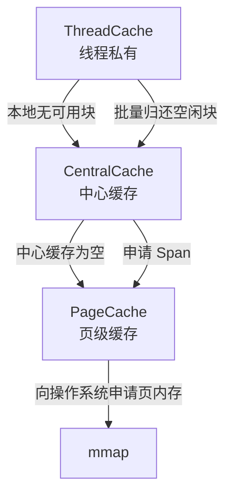

# Memory Pool

一个基于 **ThreadCache / CentralCache / PageCache** 三层结构实现的 C++ 内存池项目，主要用于优化小对象频繁申请与释放时的性能开销，并降低多线程场景下的锁竞争。

该项目使用 **C++17** 编写，使用 **CMake** 构建，底层页级内存通过 **mmap** 向操作系统申请，因此更适合在 Linux 环境下运行与测试

---

## 项目简介

系统默认的 `new/delete` 或 `malloc/free` 在大量小块内存分配、释放，以及多线程高频访问场景下，可能会带来较高的分配器管理开销和锁竞争。

本项目通过三级缓存分配器的方式，对不同粒度的内存管理进行分层处理：

- **ThreadCache**：线程私有缓存，优先在本线程内完成分配与回收，减少加锁开销。
- **CentralCache**：线程共享的中心缓存，负责为各线程批量提供同一规格的小块内存。
- **PageCache**：页级缓存，负责管理更大粒度的 Span，并通过 `mmap` 向操作系统申请页内存。

整体目标：

- 提高小对象分配效率
- 降低多线程竞争
- 减少频繁向操作系统申请内存的次数
- 形成较清晰的分层内存管理结构，便于学习与扩展

---

## 项目特性

- 基于三层缓存结构的内存池设计
- 按 **8 字节对齐** 管理小块内存
- 小于等于 **256 KB** 的申请走内存池路径
- 大于 **256 KB** 的申请直接回退到 `malloc/free`
- `ThreadCache` 使用 `thread_local`，降低线程间竞争
- `CentralCache` 按 size class 维护共享自由链表
- `PageCache` 以页（4 KB）为单位管理 Span
- 提供正确性测试与性能测试
- 使用 CMake 构建，便于在 Linux 环境下编译运行

---

## 核心参数

项目中的部分关键常量定义如下：

- `ALIGNMENT = 8`
- `PAGE_SIZE = 4096`
- `SPAN_PAGES = 8`
- `MAX_BYTES = 256 * 1024`
- `FREE_LIST_SIZE = MAX_BYTES / ALIGNMENT`

这意味着：

- 小对象会按照 8 字节向上对齐
- 页缓存默认以 4 KB 页为基本单位
- 常规小块分配优先从 8 页的 Span 中切分
- 最大受内存池管理的小块大小为 256 KB

---

## 项目结构

```text
memory_pool/
├── CMakeLists.txt
├── include/
│   ├── Common.h
│   ├── ThreadCache.h
│   ├── CentralCache.h
│   └── PageCache.h
├── src/
│   ├── ThreadCache.cpp
│   ├── CentralCache.cpp
│   └── PageCache.cpp
├── test/
│   └── test_memory_pool.cpp
└── README.md
```

各模块职责如下：

| 文件 | 作用 |
|---|---|
| `Common.h` | 公共常量与 `SizeClass` 映射规则 |
| `ThreadCache.*` | 线程本地缓存，负责分配与回收小块对象 |
| `CentralCache.*` | 中心缓存，负责批量分发与回收同规格内存块 |
| `PageCache.*` | 页级缓存，负责 Span 管理与系统内存申请 |
| `test_memory_pool.cpp` | 正确性测试与性能测试 |

---

## 整体架构



### 一次分配的大致流程

1. 线程调用 `ThreadCache::allocate(size)`
2. 将 `size` 按 8 字节对齐，并映射到对应的 size class
3. 若当前线程的自由链表非空，直接返回一块内存
4. 若线程缓存为空，则向 `CentralCache` 批量申请
5. 若 `CentralCache` 也为空，则继续向 `PageCache` 申请 Span
6. `PageCache` 必要时通过 `mmap` 向系统申请新页
7. `CentralCache` 将 Span 切分为多个同规格的小块，并批量返回给 `ThreadCache`
8. `ThreadCache` 将其中一块返回给用户，其余小块缓存在线程本地

### 一次释放的大致流程

1. 线程调用 `ThreadCache::deallocate(ptr, size)`
2. 小块内存先回收到当前线程的自由链表
3. 当线程缓存数量超过阈值后，批量归还给 `CentralCache`
4. `CentralCache` 将归还的小块挂回对应 size class 的共享自由链表，供后续线程复用
5. 当前版本暂未实现 `CentralCache` 将完全空闲的 Span 主动归还给 `PageCache`

---

## 关键实现说明

### 1. SizeClass 映射

项目通过 `SizeClass` 将用户请求大小映射到固定规格：

- `roundUp(bytes)`：按 8 字节向上对齐
- `getIndex(bytes)`：将大小映射到自由链表下标
- `indexToSize(index)`：由链表下标反推块大小

这样可以避免维护过于零散的内存块规格，简化分配与回收逻辑。

### 2. ThreadCache

`ThreadCache` 是线程本地缓存：

- 每个线程拥有独立的自由链表数组
- 分配时优先从本线程缓存中取块
- 释放时优先归还给本线程缓存
- 当缓存过多时，批量归还给 `CentralCache`

这样做的好处是：**绝大多数小块分配不需要加锁**。

### 3. CentralCache

`CentralCache` 是线程共享层：

- 按 size class 维护共享自由链表
- 不同规格对应不同锁，降低锁粒度
- 当某个规格的链表为空时，从 `PageCache` 申请 Span 并切分为多个小块
- 接收 `ThreadCache` 批量归还的小块，并挂回对应 size class 的自由链表

这层的核心作用是：**在线程本地缓存和页级缓存之间做批量中转**。

### 4. PageCache

`PageCache` 负责页级 Span 管理：

- 以页为单位维护空闲 Span
- 使用 `std::map<size_t, Span*> freeSpans_` 管理不同页数的空闲 Span
- 使用 `std::map<void*, Span*> spanMap_` 记录地址到 Span 的映射
- 当缓存不足时，通过 `mmap` 申请系统内存

当前实现具备基本的 Span 复用能力，并支持与后继相邻空闲 Span 的合并。

### 5. 大对象处理

当申请大小 **超过 256 KB** 时，不再走内存池，而是直接使用：

- `std::malloc(size)`
- `std::free(ptr)`

这样可以避免超大块内存把小对象内存池结构拖得过重。

---

## 当前实现说明

当前版本重点实现了三层缓存分配链路：

```text
ThreadCache -> CentralCache -> PageCache -> mmap
```

释放时，小块内存主要在 `ThreadCache` 和 `CentralCache` 之间流转并复用：

```text
ThreadCache -> CentralCache
```

也就是说，当前版本没有维护完整的 block-to-Span 映射，也没有统计某个 Span 中所有 block 是否都已经空闲。因此，`CentralCache` 暂时不会主动把完全空闲的 Span 归还给 `PageCache`。

这个设计可以减少元数据维护成本，使实现更简洁，适合作为学习型和项目型内存池版本。后续如果需要增强内存回收能力，可以在 `CentralCache` 中增加 Span 元数据追踪，再实现完整 Span 回收。

---

## 编译与运行

### 1. 克隆项目

```bash
git clone <your-repo-url>
cd memory_pool
```

### 2. 使用 CMake 构建

```bash
cmake -S . -B build
cmake --build build
```

### 3. 运行测试程序

```bash
./build/test_memory_pool
```

### 4. 运行 CTest

```bash
cd build
ctest --output-on-failure
```

---

## 测试内容

项目测试分为两部分：

### 正确性测试

位于 `test/test_memory_pool.cpp`，主要覆盖：

- **Basic sizes**：基础尺寸分配与释放
- **Boundary sizes**：边界尺寸测试，如 7/8/9、255/256/257、`MAX_BYTES` 附近等
- **Reuse behavior**：验证回收后的内存块能否再次复用
- **Multi-thread smoke**：多线程并发下的基本正确性验证

测试中会向内存块写入特定模式数据，并在释放前校验内容是否被破坏。

### 性能测试

性能测试将内存池与系统 `new/delete` 进行对比，包含：

- **Small fixed sizes**：固定小块分配场景
- **Mixed sizes**：多种尺寸混合分配场景
- **Multi-thread**：多线程并发分配场景

---

## 一次实际运行结果

下面是当前版本在本地一次运行得到的测试输出：

```text
Starting memory pool tests...

================ Correctness Tests ================
[PASS] Basic sizes
[PASS] Boundary sizes
[PASS] Reuse behavior
[PASS] Multi-thread smoke
[ALL PASS] correctness tests passed.

================ Performance Tests ================
Benchmark               MemoryPool(ms)    new/delete(ms)       Speedup
----------------------------------------------------------------------
Small fixed sizes                2.222             1.926          0.87
Mixed sizes                      7.800             8.034          1.03
Multi-thread                     5.675            16.697          2.94

All tests finished successfully.
```

说明：不同机器、编译参数、负载模型下结果会有波动，多线程场景通常更能体现线程本地缓存的优势。

---

## 使用方式示例

当前项目对外的主要使用方式是直接调用 `ThreadCache`：

```cpp
#include "ThreadCache.h"

using namespace memoryPool;

int main() {
    void* p = ThreadCache::getInstance()->allocate(64);

    // 使用内存...

    ThreadCache::getInstance()->deallocate(p, 64);
    return 0;
}
```

需要注意：

- 释放时需要传入正确的 `size`
- 大于 `MAX_BYTES` 的内存会自动走系统分配路径
- 当前实现更偏向学习型、项目型内存池，而不是完整工业级分配器

---

## 该项目的亮点

这个项目比较适合作为 **C++ 后端 / 基础组件 / 性能优化方向** 的项目展示，可以突出以下关键词：

- C++17
- 内存池
- 高并发
- 线程本地缓存
- 分层分配器
- mmap
- 性能测试
- 多线程优化

概括就是：

> 基于 C++17 实现三层结构内存池，采用 ThreadCache / CentralCache / PageCache 分层设计，对小对象分配进行缓存优化；支持多线程场景下的高频内存申请与释放，并通过正确性测试与性能测试验证实现效果。

---

## 后续优化方向

如果继续完善，这个项目还可以往下扩展：

- 增加 `CentralCache` 对 Span 的空闲块统计，实现完整 Span 回收到 `PageCache`
- 增加更完整的 Span 前后双向合并策略
- 引入无锁或更细粒度同步方案
- 为对象构造/析构封装 `newElement/deleteElement` 风格接口
- 补充更多 benchmark 场景
- 增加统计信息，如命中率、系统申请次数、线程缓存回收次数等
- 提供更友好的对外接口与示例

---

## 运行环境

- Linux
- GCC / Clang
- C++17
- CMake 3.16 及以上
- POSIX `mmap`
